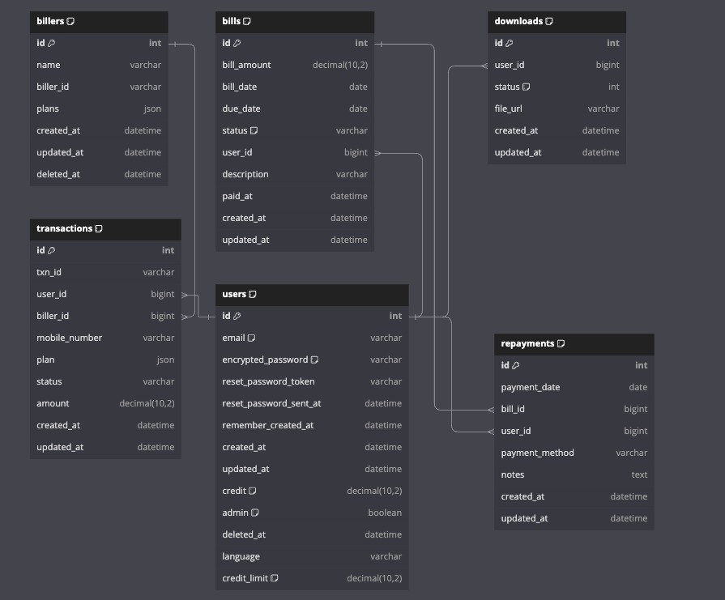

# Easypay - PayLater Mobile Recharge App

## Objective

Easypay is a pay-later mobile recharge app that allows users to recharge their mobile phone carrier plans using credits. Users can pay their bills once every 15 days to restore the credits they've spent. The objective of this project is to create a scalable and highly available pay-later system using various Rails concepts and best practices.

## Features

- **PayLater**: Users can recharge their mobile plans using credits and pay the bills when they are generated.
- **Asynchronous Payment Processing**: Payments are processed in the background using Sidekiq.
- **Notifications (Mimicked)**: Users receive notifications via SMS, push notifications, and email for payment reminders and updates.
- **Analytics**: Events from the app are sent to a read-only analytics service for high-performance data queries.
- **Logging and Monitoring**: Application and framework logs are captured and monitored using the ELK stack.
- **Rate Limiting**: Application is rate limited using a middleware. 

---

## Diagrams
### Architecture Diagram

### ER Diagram

### Code Flow Diagram

---

## Key Concepts Used

### Authentication, Authorization, and Sessions

Easypay uses Devise for authentication and a role-based authorization system. Sessions are used to manage user logins and activity across the app.

### Redis and Caching

Redis is used as the caching layer for improving performance, reducing load times, and handling session storage.

### Fixtures and Seed Data

Fixtures and seed data are used to populate the database with initial data for development and testing purposes.

### Migrations

Database migrations handle schema changes, ensuring the database remains consistent across different environments.

### Rails Console

The Rails console is utilized for interacting with the application during development, debugging, and inspecting database records.

### Callbacks

Callbacks in Rails are used to manage the lifecycle of models, such as ensuring validations are applied or certain actions (like sending notifications) are triggered when events occur.

### RSpec

RSpec is used to test the application, ensuring that features work as expected and edge cases are handled.

### API Integration with Ruby

External APIs can be called from the backend using Ruby’s built-in HTTP libraries to integrate with other micro services.

### Basic Rails UI Code

The app uses basic Rails views with embedded Ruby (ERB) templates for rendering UI components like forms and tables.

### Flags Based on Account

Flags are used to enable or disable specific features based on user accounts, offering personalized experiences.

### SaaS Architecture

The app uses a multi-tenant SaaS architecture, where all tables are sharded based on the account. This ensures data separation and efficient querying.

### Validations

- **Controller Validations**: Controller-level validations ensure that inputs from forms are sanitized and comply with business rules.
- **Model Validations**: Models enforce database integrity, ensuring fields contain valid data before records are saved.

### Scopes

Custom scopes in models help filter data efficiently, like retrieving active users and billers.

### Rake Jobs

Rake jobs are used for periodic tasks like reassessing payment requests.

### Blueprints

Blueprints are used to generate structured JSON responses in HTTP responses, ensuring a consistent and standardized format for API output.

### I18N (Internationalization)

The app supports multiple languages, enabling easy localization of text and messages for users across different regions.

### N+1 Query Prevention

Rails' eager loading techniques (e.g., `includes`, `joins`) are used to avoid N+1 queries and improve database performance.

### Sidekiq

Sidekiq is used for asynchronous background payment processing.

### Elasticsearch

Elasticsearch is integrated to provide efficient searching capabilities for large datasets, especially when dealing with transaction history.

---

## Design and Architecture Patterns Used

### Event-Driven Architecture

The app uses an event-driven architecture, where Kafka is used to send events from the main app to different services (e.g., the notification service and the analytics service).

### Adapter Pattern

The notification service uses the Adapter pattern to convert notifications into multiple formats (SMS, push notifications, email), ensuring flexibility and scalability.

### CQRS (Command Query Responsibility Segregation)

The app uses the CQRS pattern, separating read and write operations into different models to optimize performance. The analytics service uses a high-read database populated by payment events.

### Observer Pattern

The Kafka-based event system follows the Observer pattern, where events are published by the app and consumed by services like notifications and analytics.

### Service-Oriented Architecture (SOA)

The app's microservice architecture involves separate services for the core app, notifications, and analytics, making it easier to scale and maintain each service independently.

---

## Logging and Monitoring

The ELK (Elasticsearch, Logstash, Kibana) stack is used for logging and monitoring. Application logs and framework logs are monitored for performance and debugging purposes.

---

